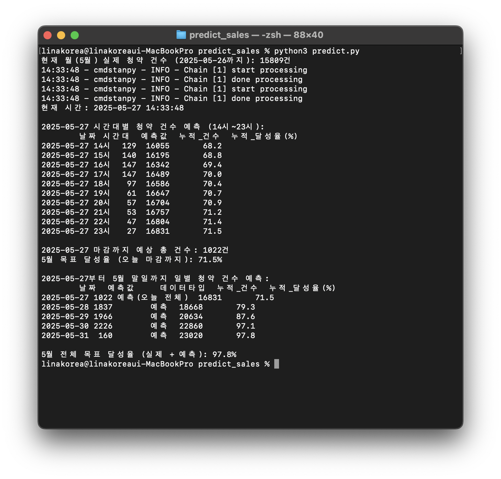

# 📈 하루 청약 건수 예측 모델

## 🔧 사용법 (간단 요약)

1. **입력 데이터**: 시간대별 청약 건수  
   예: 00시~현재 시각까지의 각 시간대별 청약 건수

2. **실행 방법**:
   - Python 스크립트 실행  
     ```bash
     python predict_daily_total.py
     ```
   - 또는 웹 인터페이스 입력 (예: Streamlit, Dash 등)

3. **출력 결과**:
   - 예측 하루 총 청약 건수 (예: `예상 3,250건`)
   - 필요 시 신뢰 구간도 함께 제공

---

## 🧠 모델 개요

이 모델은 **현재까지의 시간대별 청약 데이터를 기반으로**  
**하루 전체 청약 건수를 실시간 예측**하는 머신러닝 모델입니다.

> 오전 9시까지 청약 패턴을 보면 오늘 하루는 총 몇 건이 될 것인지 예측합니다.

---

## 🔍 예측 프로세스

1. **데이터 수집 및 전처리**
   - 시간대별 청약 건수 (00~23시)
   - 요일/공휴일/특이 이벤트 등의 외부 변수 포함 가능

2. **특성 추출 (Features)**
   - 현재 시점까지의 누적 청약 수
   - 시간대별 청약 비중
   - 평균 대비 진행 속도
   - 예측 시점 (시간대 정보)

3. **모델 구성**
   - 사용 알고리즘 예시:
     - Gradient Boosting Regressor
     - Random Forest Regressor
     - LSTM (시계열 기반)
   - 입력: 누적 시간대별 청약 수
   - 출력: 하루 전체 예상 청약 건수

4. **예측 결과 출력**
   - 예측값 (`예: 3,250건`)
   - 예측 시점 기준 신뢰 구간 제공 가능

---

## 📊 예시 시나리오

| 현재 시각   | 누적 청약 건수 | 예측 총 건수 | 5월 목표 달성률(%) |
|-------------|----------------|----------------|----------------------|
| 2025-05-27 14:33 | 16,055건      | 17,053건       | 71.5%               |

2025년 5월 27일 시간대별 청약 건수 예측:

| 시간대 | 시간대별 예측 건수 | 누적 청약 건수 | 누적 달성률 (%) |
|--------|--------------------|----------------|------------------|
| 14시   | 129건              | 16,055건       | 68.2%            |
| 15시   | 140건              | 16,195건       | 68.8%            |
| 16시   | 147건              | 16,342건       | 69.4%            |
| 17시   | 147건              | 16,489건       | 70.0%            |
| 18시   | 97건               | 16,586건       | 70.4%            |
| 19시   | 61건               | 16,647건       | 70.7%            |
| 20시   | 57건               | 16,704건       | 70.9%            |
| 21시   | 53건               | 16,757건       | 71.2%            |
| 22시   | 47건               | 16,804건       | 71.4%            |
| 23시   | 27건               | 16,831건       | 71.5%            |

> ✅ **2025-05-27 마감까지 예상 총 청약 건수**: 1,022건  
> ✅ **오늘 마감 기준 누적 달성률**: **71.5%**

---

### 📅 5월 말까지의 청약 예측

| 날짜        | 예측 건수 | 데이터 타입     | 누적 청약 건수 | 누적 달성률 (%) |
|-------------|-----------|------------------|----------------|------------------|
| 2025-05-27  | 1,022건   | 예측 (오늘 전체) | 16,831건       | 71.5%            |
| 2025-05-28  | 1,837건   | 예측             | 18,668건       | 79.3%            |
| 2025-05-29  | 1,966건   | 예측             | 20,634건       | 87.6%            |
| 2025-05-30  | 2,226건   | 예측             | 22,860건       | 97.1%            |
| 2025-05-31  | 160건     | 예측             | 23,020건       | 97.8%            |

> 🎯 **5월 전체 목표 달성률 (실적 + 예측)**: **97.8%**

---

## 🖼️ 실행 예시



---

## 📌 활용 포인트

- **실시간 모니터링**: 현재 추세가 목표 대비 빠른지 확인
- **운영 대응**: 예상 피크시간에 맞춰 인력 조정
- **성과 예측**: 목표 달성 가능성 분석 및 전략 수립

---

## 📂 폴더 구조 (예시)
